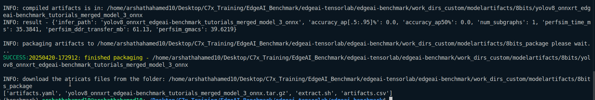

## First I do  the Setup Process
### Install Dependencies
```sh
echo ${SHELL}
sudo apt update
sudo apt install build-essential curl libbz2-dev libffi-dev liblzma-dev libncursesw5-dev libreadline-dev libsqlite3-dev libssl-dev libxml2-dev libxmlsec1-dev llvm make tk-dev wget xz-utils zlib1g-dev
curl -L https://github.com/pyenv/pyenv-installer/raw/master/bin/pyenv-installer | bash
echo '# pyenv settings ' >> ${HOME}/.bashrc
echo 'command -v pyenv >/dev/null || export PATH=":${HOME}/.pyenv/bin:$PATH"' >> ${HOME}/.bashrc
echo 'eval "$(pyenv init -)"' >> ${HOME}/.bashrc
echo 'eval "$(pyenv virtualenv-init -)"' >> ${HOME}/.bashrc
echo '' >> ${HOME}/.bashrc
exec ${SHELL}
pyenv install 3.10
```
### To activate Environment
```sh
pyenv virtualenv 3.10 benchmark
pyenv activate benchmark
pip install --upgrade pip setuptools
pyenv activate benchmark
git clone https://github.com/TexasInstruments/edgeai-tensorlab.git
cd edgeai-tensorlab/edgeai-benchmark/
./setup_pc.sh
```
* Note : Everytime when we enter , we need to activate the environment 
```sh
pyenv activate benchmark
```
## To run example program
1. The tutorials program is in the directory `edgeai-tensorlab/edgeai-benchmark/tutorials`
* To run we need to run the script : [link](https://github.com/TexasInstruments/edgeai-tensorlab/blob/main/edgeai-benchmark/run_tutorials_script_pc.sh)
* The `tutorial_basic1.py` have the import and infernce for the classification model . For Detection model , create a new python file and store our code [here](./code/run_import_inference_for_detection.py) and store it in tutorials director and to run write it in run_tutorials_script_pc.sh
```py
python3 ./tutorials/run_import_inference_for_detection.py --run_type="IMPORT"
python3 ./tutorials/run_import_inference_for_detection.py --run_type="INFERENCE"
```
* Make sure have the dataset path and model path in the directory 
    * For dataset, I created the directory in `edgeai-tensorlab/edgeai-benchmark/dependencies/datasets/own_dataset_for_detection` or you can create your own dataset and change the dirctory . (My dataset [link](./datasets/own_dataset_for_detection/)) . The directory have the both input and output images . 
    * To Get our model [Yolov8m.onnx compatible for TIDL](./model/merged_model_3.onnx)
## To run a Benchmarking
* The script is in the tutorials dorecctory (edgeai-tensorlab/edgeai-benchmark/tutorials/tutorial_detection.py)
* If you are using ONNX file make sure change the session name and pipeline config into ONNX 
```py
session_name = constants.SESSION_NAME_ONNXRT
pipeline_configs = {
    'yolov8': dict(
        task_type='detection',
        calibration_dataset=calib_dataset,
        input_dataset=val_dataset,
        preprocess=preproc_transforms.get_transform_onnx((640,640), (640,640), backend='cv2'),
        session=session_type(**onnx_session_cfg,
            runtime_options=runtime_options,
            model_path = os.path.abspath('./tutorials/merged_model_3.onnx')),
        postprocess=postproc_transforms.get_transform_detection_onnx(),
        metric=dict(label_offset_pred=datasets.coco_det_label_offset_90to90()),
        model_info=dict(metric_reference={'accuracy_ap[.5:.95]%':23.0})
    )
}
```
* Then Run the tutuoral script and uncomment the detection runninf file we get the benchmark output
